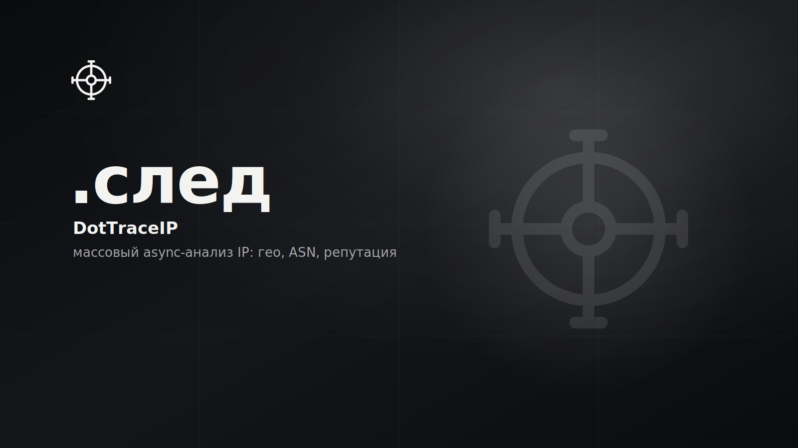

# DotTraceIP

<p>
  
  
  
  <!-- loc:start --><!-- loc:end -->
</p>



Многопоточный CLI-инструмент для массового сбора данных об IP-адресах. Получает hostname, страну, город, провайдера, ASN и CIDR сети через HTTP и SOCKS-прокси с живым дашбордом в терминале.

## Запуск

```bash
pip install -r requirements.txt
python main.py
```

Первый запуск создаёт `data/target_ips.txt` и `data/proxies.txt`. Добавь IP-адреса и прокси, затем выбери «Запустить сканирование» в меню.

## Команды

| Команда | Назначение |
|---------|------------|
| `pip install -r requirements.txt` | установка зависимостей |
| `python main.py` | интерактивное TUI-меню |

## Стек

<p>
  
  
  
  
</p>

## Архитектура

`cli.py` рисует меню, `engine.py` запускает потоки и управляет `Live`-дашбордом, `network.py` делает запросы к ip-api.com и RDAP, `config.py` и `utils.py` - вспомогательные.

```
DotTraceIP/
├── main.py              # точка входа → run_app()
├── config.json          # персистентные настройки (не в git)
├── requirements.txt
├── app/
│   ├── cli.py           # TUI-меню (Rich Prompt + Panel)
│   ├── engine.py        # сканирование + проверка прокси + Live-дашборд
│   ├── network.py       # HTTP ip-api.com, WHOIS/RDAP (ipwhois)
│   ├── config.py        # load/save config.json
│   └── utils.py         # чтение файлов, запись результатов
└── data/
    ├── target_ips.txt   # список IP для сканирования
    ├── proxies.txt      # пул прокси
    └── results.txt      # вывод plain-text
```

- `main.py` содержит только вызов `run_app()` - вся логика в `app/`
- каждый запрос случайно выбирает прокси из пула (`random.choice`)
- результаты записываются построчно сразу после получения ответа
- `config.json` и `data/*.txt` не в git

## Лицензия

© 2026 DotCore. Все права защищены.

Проприетарный код. Использование, копирование, изменение и распространение запрещены без письменного разрешения автора. Исходный код открыт только для ознакомления. См. [LICENSE](LICENSE).
